# REX POC — Système Intelligent de Gestion de File d'Attente (IQMS)
## Retour d'Expérience
**Juin 2026**

---

## 1. Contexte & Enjeux Opérationnels

* **Expérience client en magasin** : L'attente en caisse est le principal point de friction du parcours d'achat.
* **Optimisation des ressources** : Ajuster la présence des hôtes de caisse en fonction de l'affluence réelle.
* **Pilotage par la donnée** : Passer d'une gestion réactive (subir la file) à une gestion proactive (anticiper la file).
* **Le POC IQMS** : Expérimentation sur site réel pour valider les briques technologiques IA, base de données et prédiction.

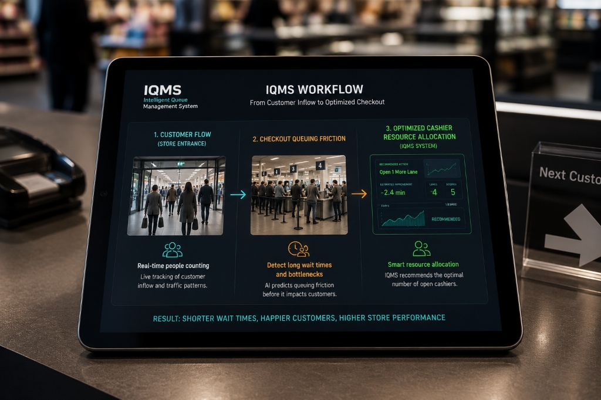
---

## 2. Objectifs de l'Évaluation Pilote (POC)

* **Fiabilité du comptage vidéo** : Mesurer l'exactitude de la détection et du suivi individuel des clients.
* **Précision des algorithmes prédictifs** : Valider la capacité à anticiper la charge à 15, 30 et 60 minutes.
* **Industrialisation de la stack** : Évaluer la stabilité de la base de données temporelle sous flux continu.
* **Facilité d'intégration** : Identifier les bonnes pratiques de déploiement pour le partenaire intégrateur.

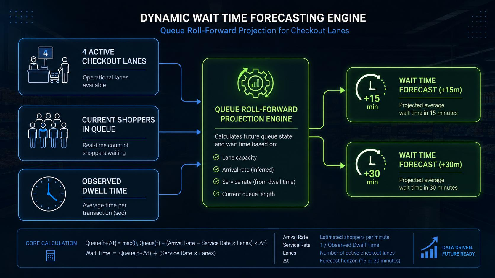
---

## 3. Architecture Technique du Système

* Un flux asynchrone qui sépare le traitement vidéo de la base de données.
* Une couche prédictive décorrélée pour ne pas ralentir la supervision en temps réel.
---

## 4. Placement Caméra : L'Importance de la Perspective

* **Recommandation principale** : Installer les caméras avec un angle de vue en **perspective** (vue semi-plongeante).
* **Avantages métiers** :
  * Permet de distinguer les clients alignés les uns derrière les autres.
  * Améliore la précision du calcul des temps de présence (dwell time).

---

## 5. Placement Caméra : Limites & Perspectives Panoramiques

* **Retour sur la caméra panoramique 360°** :
  * **Intention initiale** : Prévue dans le design de base pour offrir une vision globale de la zone de sortie des caisses.
  * **Limitation POC** : Non déployée en raison d'incidents techniques lors de la phase de test sur site.
* **Perspectives et valeur ajoutée** :
  * **Vision d'ensemble** : Utile pour analyser la dynamique globale du trafic en sortie de caisses.
  * **Supervision active** : Permettrait de valider automatiquement la présence physique des caissiers pour déterminer si une ligne est active ou non.
* **Recommandation** : Utiliser des caméras IP standards en attendant de résoudre l'intégration de la caméra panoramique.

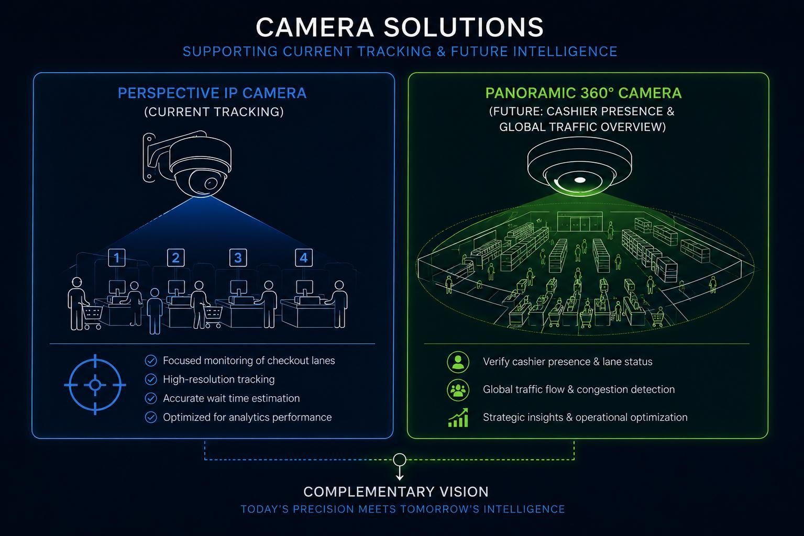
---

## 6. Analyse Vidéo IA : Option A (Head-Detector)

* **Mécanisme** : Détection ciblée des têtes des clients (modèle YOLOv9 spécialisé).
* **Points forts** :
  * Très efficace dans les environnements à forte densité et de passage rapide.
  * Moins sensible aux masquages partiels du corps.
* **Performance & Matériel** :
  * **Optimisation matérielle** : Excellentes performances démontrées sur des **CPU Intel récents** via l'accélération native **ONNX / OpenVINO** (choix optimal pour le déploiement sur site).
  * **Option dédiée** : Compatibilité GPU + TensorRT disponible, mais non indispensable.

---

## 7. Analyse Vidéo IA : Option B (Silhouette & Face)

* **Mechanism** : Détection complète du corps combinée à une analyse des attributs (âge, genre, sacs).
* **Points forts** :
  * Fournit des données démographiques riches pour les analyses marketing.
  * Idéal pour les caméras placées face aux caisses ou aux entrées principales.
* **Matériel recommandé** : Processeurs standards (CPU) optimisés ou serveurs légers.

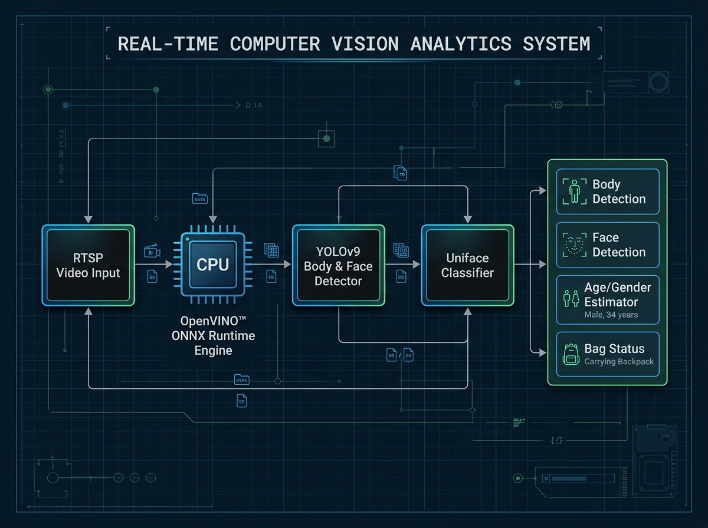
---

## 8. Analyse Vidéo IA : Le Moteur de Suivi (Tracker)

* **Technologie embarquée** : Utilisation du tracker Norfair pour associer les détections d'une image à l'autre.
* **Logique de validation (Insert-at-death)** :
  * Aucun événement n'est écrit en base lors de la première apparition.
  * L'enregistrement final en base de données s'effectue uniquement lorsque le client quitte définitivement la zone d'analyse.
  * Garantit l'exactitude du calcul de la durée de présence globale (dwell time).

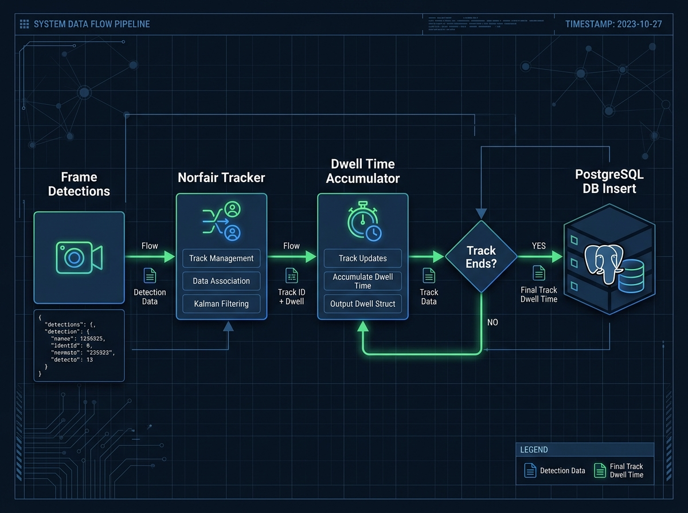
---

## 9. Analyse Vidéo IA : Bilan des Performances

Les fonctions d'analyse vidéo ont donné **des taux de détection très satisfaisants** lors du POC :

* **Comptage précis** : Taux de détection et de suivi individuel supérieur aux attentes du pilote.
* **Robustesse opérationnelle** : Le système maintient la cohésion des trajectoires individuelles même en cas d'arrêts prolongés des clients en file.
* **Résilience** : Excellente tolérance aux variations lumineuses du magasin.

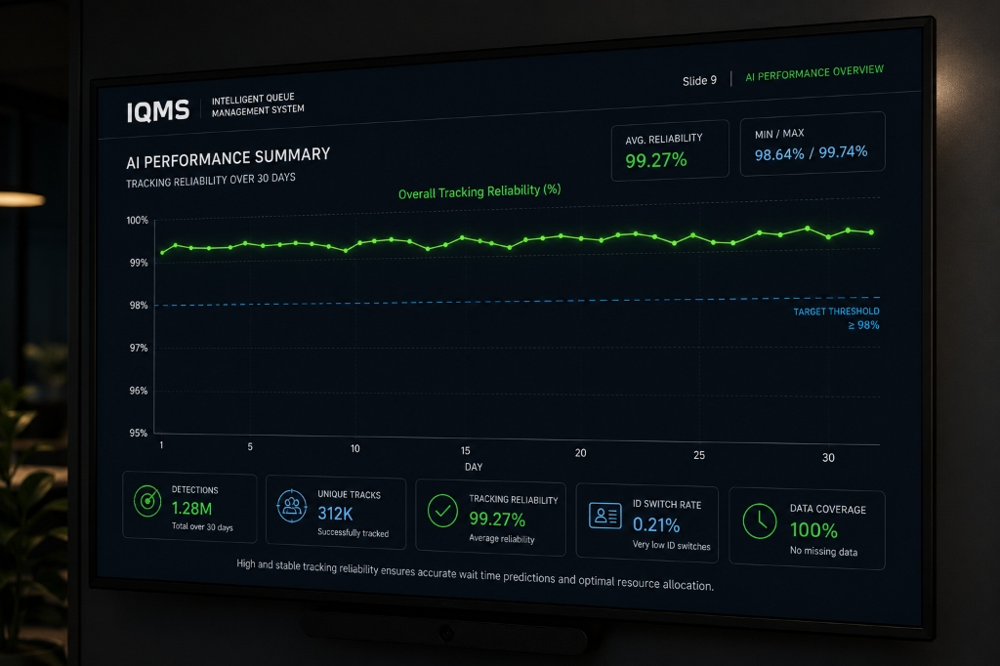
---

## 10. Base de Données : Le Choix de TimescaleDB

* **Technologie retenue** : PostgreSQL couplé à l'extension temporelle **TimescaleDB**.
* **Pourquoi ce choix ?**
  * Spécialement conçu pour ingérer d'importants volumes de données de séries temporelles.
  * Performances de requêtage élevées pour alimenter le dashboard en temps réel.
  * Fonctionnalités de compression automatique des données historiques pour économiser l'espace disque.

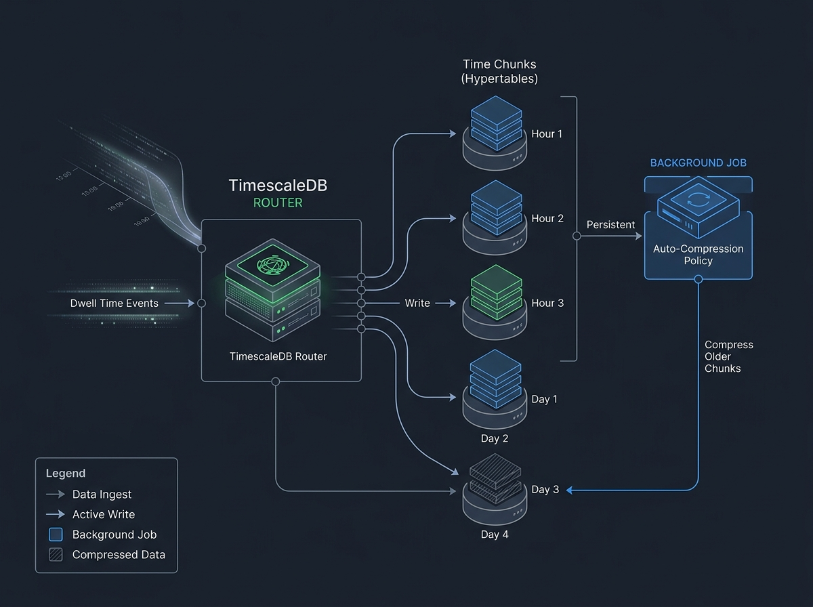
---

## 11. Base de Données : Structure des Hypertables

L'organisation des données repose sur trois hypertables temporelles optimisées par TimescaleDB :

* **Événements d'Entrée/Passage (`entrance_events`)** : Enregistre chaque client détecté avec ses attributs démographiques et sa durée de passage.
  * *Champs* : `timestamp` (TIMESTAMPTZ), `camera_id`, `track_id`, `gender`, `age_estimate`, `dwell_seconds`, `has_bag`.
* **Supervision des Files (`queue_state_snapshots`)** : Captures régulières de la file d'attente toutes les 10 secondes.
  * *Champs* : `timestamp` (TIMESTAMPTZ), `camera_id`, `queue_count`, `active_lanes`, `avg_dwell_sec`, `max_dwell_sec`.
* **Événements de Caisse (`service_events`)** : Enregistre la durée finale de service/transaction de chaque client en caisse.
  * *Champs* : `timestamp` (TIMESTAMPTZ), `camera_id`, `track_id`, `total_dwell_sec`.

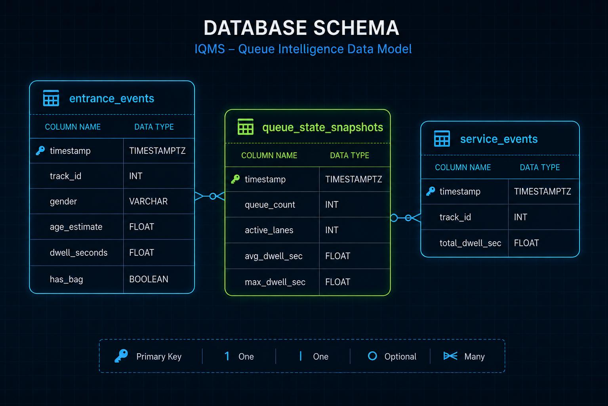
---

## 12. Moteur de Prévision : Modèle 1 (Prophet)

* **Rôle** : Analyse statistique des tendances globales.
* **Fonctionnement** :
  * Détecte les variations saisonnières régulières (heures de repas, jours de la semaine, week-ends).
  * Établit la ligne directrice de la prévision à long terme en se basant sur l'historique des semaines précédentes.
* **Bénéfice** : Capture les grands rendez-vous de fréquentation du magasin.

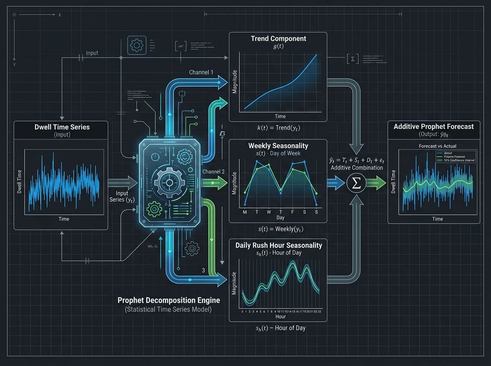
---

## 13. Moteur de Prévision : Modèle 2 (LSTM)

* **Rôle** : Réseau de neurones récurrents (Deep Learning) pour l'analyse des séquences.
* **Fonctionnement** :
  * Analyse l'évolution immédiate de la file minute par minute.
  * Capture les changements brusques de dynamique à très court terme (ex : arrivée soudaine d'un groupe de clients).

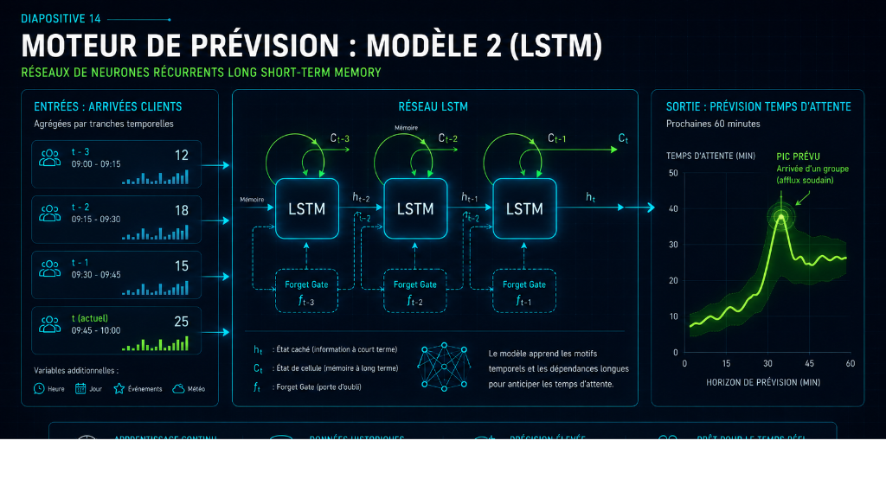
---

## 14. Moteur de Prévision : Modèle 3 (XGBoost)

* **Rôle** : Algorithme d'apprentissage automatique basé sur des arbres de décision.
* **Fonctionnement** :
  * Corrige les prévisions en croisant les données temporelles avec des variables contextuelles (ex : nombre de caisses actuellement ouvertes).
* **Bénéfice** : Adapte la prévision à la configuration opérationnelle instantanée du magasin.

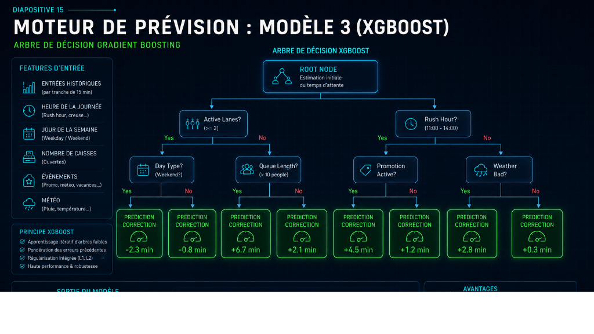
---

## 15. Moteur de Prévision : L'Approche d'Ensemble

* **Synergie des modèles** : Les prévisions individuelles de Prophet, LSTM et XGBoost sont combinées pour générer une courbe prédictive unique et équilibrée.
* **Optimisation des ressources serveur** :
  * Les modèles lourds (LSTM, XGBoost) sont persistés sur disque.
  * Ils sont rechargés automatiquement sans réentraînement systématique à chaque cycle, ce qui divise par 10 la consommation CPU du serveur.

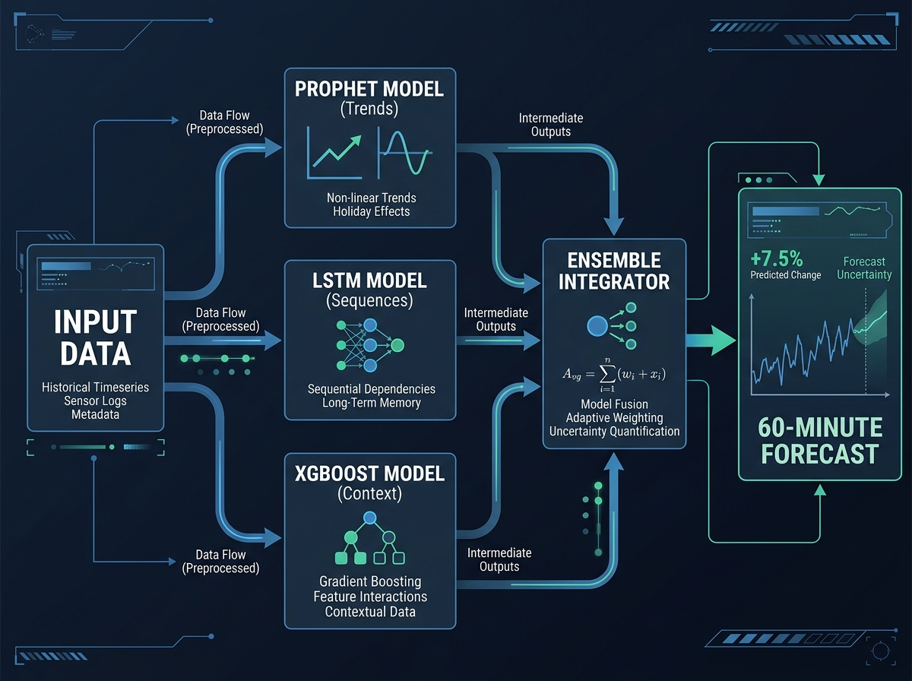
---

## 16. Formule Dynamique du Temps d'Attente

* **Calcul classique** : Simple ratio statique basé sur le volume historique d'entrées.
* **Calcul dynamique mis en place** :
  1. Lecture de l'instantané de l'état de la file (`queue_state_snapshots`).
  2. Prise en compte du nombre de caisses actives réelles.
  3. Projection temporelle pour estimer les temps d'attente à court terme (`wait_15m` et `wait_30m`).
* **Intérêt opérationnel** : Une vision proactive pour ouvrir les caisses avant la saturation.

---

## 17. Web App Opérateur : Le Dashboard Live (Streamlit)

* **Accès local** : Dashboard consultable via navigateur à l'adresse `http://localhost:8501`.
* **Indicateurs affichés** :
  * **IN QUEUE NOW** : Nombre estimé de personnes en file (mis à jour toutes les 10 secondes).
  * **EST. WAIT (+15m, +30m, +45m)** : Temps d'attente estimé pour les clients à venir.
  * **ENTRIES TODAY** : Nombre total d'entrées depuis minuit.
* **Indicateur de statut** : Code couleur intuitif pour le manager (OK - Vert < 5m, BUSY - Orange 5-10m, ALERT - Rouge >= 10m).
* **Onglet historique** : Visualisation du volume d'entrées sur 30 jours et taux de port de sacs.

---

## 18. L'Application Mobile Opérateur (React Native + Expo)

* **Technologie cible** : Application multi-plateforme compilée sous **React Native (Expo)** (`IQMSManager`).
* **Usage sur le terrain** :
  * Compagnon mobile pour le manager ou le personnel en rayon (permet de s'affranchir d'un écran fixe).
  * Design moderne optimisé en mode sombre pour une visibilité accrue.
* **Affichage des caisses** : Statut précis par ligne de caisse (OPEN, CLOSED, BUSY, BUSY_HIGH).
* **Communication API** : Connexion temps réel avec le serveur via un tunnel sécurisé ngrok.

---

## 19. Le Simulateur & Visualisation 2D au Sol

* **Moteur de simulation** : Simulation d'événements physiques via serveur WebSocket local (port 8080).
* **Rendu visuel interactif** :
  * Visualisation 2D animée du plan du magasin (dessinée sur Canvas HTML5, servie sur le port 8081).
  * Permet de simuler des rushs clients (déjeuner, soir) et de voir le comportement de la file d'attente.
* **Utilité** : Tester la robustesse opérationnelle de la stack complète avant raccordement des caméras physiques.

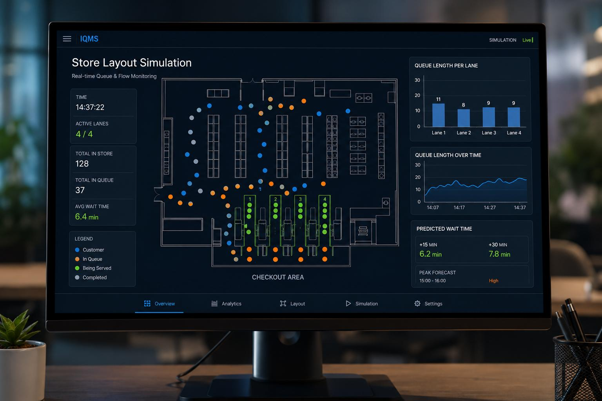
---

## 20. Ordonnancement : Automatisation des Prédictions

* **Script d'ordonnancement (`run_scheduler.py`)** :
  * Tâche de fond à lancer à côté de la base de données.
  * Déclenche automatiquement l'ensemble prédictif (`ensemble_predict.py`) toutes les 15 minutes.
* **Flexibilité technique** :
  * Permet de configurer facilement la taille de l'historique d'entraînement (ex : lookback de 14 ou 30 jours).
  * Permet de filtrer la source des caméras (REAL pour la production, SIM pour le mode test).

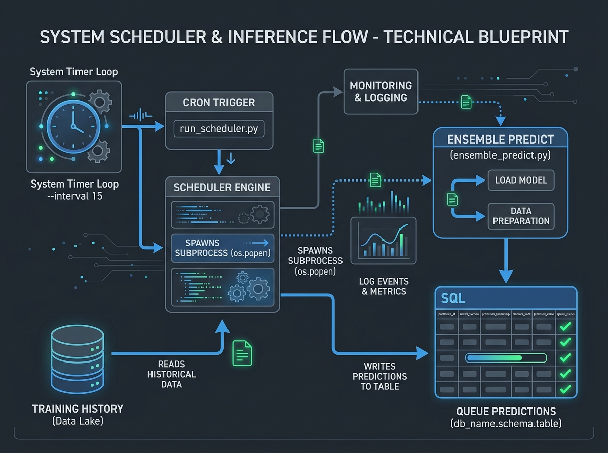
---

## 21. Feuille de Route d'Intégration (Checklist)

1. **Caméras** : Fixer les caméras standards (pas de 360°) en perspective et calibrer les polygones de détection (ROI).
2. **Base de Données** : Déployer PostgreSQL + TimescaleDB et configurer les hypertables d'événements et snapshots.
3. **Moteur IA & OpenVINO** : Activer OpenVINO pour booster l'inférence YOLOv9 en FP32 sur matériel standard.
4. **Services d'Affichage** : Configurer et démarrer le scheduler de prédiction (`run_scheduler.py`), la console Streamlit et l'application mobile Expo (`IQMSManager`).
5. **Supervision** : Connecter le tableau de bord Grafana de production aux tables pour la supervision globale.

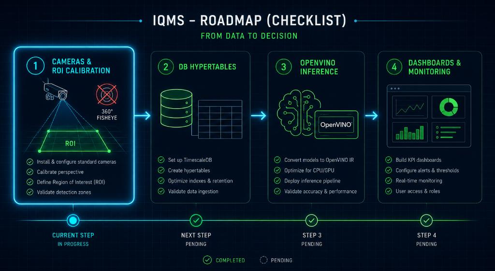
