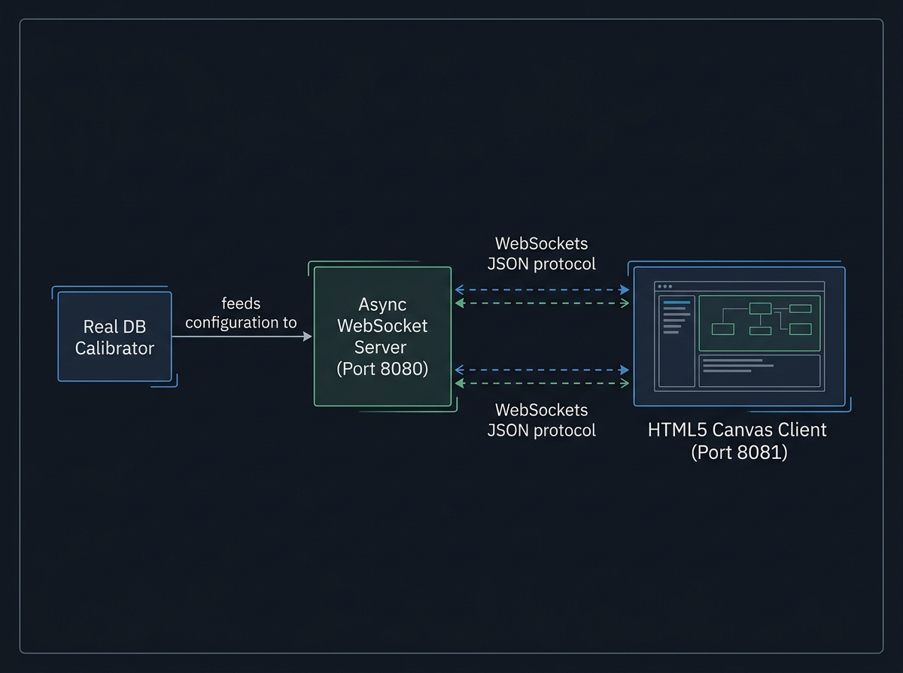

# REX POC — Système Intelligent de Gestion de File d'Attente (IQMS)
## Rapport Complet de Restitution et Guide d'Intégration
**Juin 2026**

---

## 1. Contexte & Enjeux Opérationnels

* **Expérience client en magasin** : L'attente en caisse est le principal point de friction du parcours d'achat.
* **Optimisation des ressources** : Ajuster la présence des hôtes de caisse en fonction de l'affluence réelle.
* **Pilotage par la donnée** : Passer d'une gestion réactive (subir la file) à une gestion proactive (anticiper la file).
* **Le POC IQMS** : Expérimentation sur site réel pour valider les briques technologiques IA, base de données et prédiction.

---

## 2. Objectifs de l'Évaluation Pilote (POC)

* **Fiabilité du comptage vidéo** : Mesurer l'exactitude de la détection et du suivi individuel des clients.
* **Précision des algorithmes prédictifs** : Valider la capacité à anticiper la charge à 15, 30 et 60 minutes.
* **Industrialisation de la stack** : Évaluer la stabilité de la base de données temporelle sous flux continu.
* **Facilité d'intégration** : Identifier les bonnes pratiques de déploiement pour le partenaire intégrateur.

---

## 3. Architecture Technique du Système

* Un flux asynchrone qui sépare le traitement vidéo de la base de données.
* Une couche prédictive décorrélée pour ne pas ralentir la supervision en temps réel.
---

## 4. Placement Caméra : L'Importance de la Perspective

* **Recommandation principale** : Installer les caméras avec un angle de vue en **perspective** (vue semi-plongeante).
* **Avantages métiers** :
  * Permet de distinguer les clients alignés les uns derrière les autres.
  * Améliore la précision du calcul des temps de présence (dwell time).

---

## 5. Placement Caméra : Contraintes et Limites

* **Exclusion des caméras 360°** :
  * Technologie non disponible et non prise en charge par le système de détection actuel.
  * Les distorsions optiques des caméras 360° altèrent la précision du tracking IA.
* **Préconisation d'installation** : Utiliser des caméras IP standard avec un flux RTSP haute définition stable pour chaque zone de passage.

---

## 6. Analyse Vidéo IA : Option A (Head-Detector)

* **Mécanisme** : Détection ciblée des têtes des clients (modèle YOLOv9 spécialisé).
* **Points forts** :
  * Très efficace dans les environnements à forte densité et de passage rapide.
  * Moins sensible aux masquages partiels du corps.
* **Matériel recommandé** : Serveurs équipés de cartes graphiques dédiées (GPU) supportant l'accélération matérielle TensorRT.

---

## 7. Analyse Vidéo IA : Option B (Silhouette & Face)

* **Mechanism** : Détection complète du corps combinée à une analyse des attributs (âge, genre, sacs).
* **Points forts** :
  * Fournit des données démographiques riches pour les analyses marketing.
  * Idéal pour les caméras placées face aux caisses ou aux entrées principales.
* **Matériel recommandé** : Processeurs standards (CPU) optimisés ou serveurs légers.

---

## 8. Analyse Vidéo IA : Le Moteur de Suivi (Tracker)

* **Technologie embarquée** : Utilisation du tracker Norfair pour associer les détections d'une image à l'autre.
* **Logique de validation (Insert-at-death)** :
  * Aucun événement n'est écrit en base lors de la première apparition.
  * L'enregistrement final en base de données s'effectue uniquement lorsque le client quitte définitivement la zone d'analyse.
  * Garantit l'exactitude du calcul de la durée de présence globale (dwell time).

---

## 9. Analyse Vidéo IA : Bilan des Performances

Les fonctions d'analyse vidéo ont donné de **très bons résultats (VERY Good Results)** lors du POC :

* **Comptage précis** : Taux de détection et de suivi individuel supérieur aux attentes du pilote.
* **Robustesse opérationnelle** : Le système maintient la cohésion des trajectoires individuelles même en cas d'arrêts prolongés des clients en file.
* **Résilience** : Excellente tolérance aux variations lumineuses du magasin.

---

## 10. Base de Données : Le Choix de TimescaleDB

* **Technologie retenue** : PostgreSQL couplé à l'extension temporelle **TimescaleDB**.
* **Pourquoi ce choix ?**
  * Spécialement conçu pour ingérer d'importants volumes de données de séries temporelles.
  * Performances de requêtage élevées pour alimenter le dashboard en temps réel.
  * Fonctionnalités de compression automatique des données historiques pour économiser l'espace disque.

---

## 11. Base de Données : Structure des Hypertables

L'organisation des données repose sur des hypertables optimisées par plages de temps :

* **Table des événements de passage (`entrance_events`)** : Stocke chaque entrée/sortie de client avec son horodatage et sa durée de présence.
* **Table des états de file (`queue_state_snapshots`)** : Enregistre toutes les 10 secondes le nombre de personnes en file et les caisses actives pour servir de point de repère.

---

## 12. Moteur de Prévision : Modèle 1 (Prophet)

* **Rôle** : Analyse statistique des tendances globales.
* **Fonctionnement** :
  * Détecte les variations saisonnières régulières (heures de repas, jours de la semaine, week-ends).
  * Établit la ligne directrice de la prévision à long terme en se basant sur l'historique des semaines précédentes.
* **Bénéfice** : Capture les grands rendez-vous de fréquentation du magasin.

---

## 13. Moteur de Prévision : Modèle 2 (LSTM)

* **Rôle** : Réseau de neurones récurrents (Deep Learning) pour l'analyse des séquences.
* **Fonctionnement** :
  * Analyse l'évolution immédiate de la file minute par minute.
  * Capture les changements brusques de dynamique à très court terme (ex : arrivée soudaine d'un groupe de clients).

---

## 14. Moteur de Prévision : Modèle 3 (XGBoost)

* **Rôle** : Algorithme d'apprentissage automatique basé sur des arbres de décision.
* **Fonctionnement** :
  * Corrige les prévisions en croisant les données temporelles avec des variables contextuelles (ex : nombre de caisses actuellement ouvertes).
* **Bénéfice** : Adapte la prévision à la configuration opérationnelle instantanée du magasin.

---

## 15. Moteur de Prévision : L'Approche d'Ensemble

* **Synergie des modèles** : Les prévisions individuelles de Prophet, LSTM et XGBoost sont combinées pour générer une courbe prédictive unique et équilibrée.
* **Optimisation des ressources serveur** :
  * Les modèles lourds (LSTM, XGBoost) sont persistés sur disque.
  * Ils sont rechargés automatiquement sans réentraînement systématique à chaque cycle, ce qui divise par 10 la consommation CPU du serveur.

---

## 16. Formule Dynamique du Temps d'Attente

* **Calcul classique** : Simple ratio statique basé sur le volume historique d'entrées.
* **Calcul dynamique mis en place** :
  1. Lecture de l'instantané de l'état de la file (`queue_state_snapshots`).
  2. Prise en compte du nombre de caisses actives réelles.
  3. Projection temporelle pour estimer les temps d'attente à court terme (`wait_15m` et `wait_30m`).
* **Intérêt opérationnel** : Une vision proactive pour ouvrir les caisses avant la saturation.

---

## 17. Web App Opérateur : Le Dashboard Live (Streamlit)

* **Accès local** : Dashboard consultable via navigateur à l'adresse `http://localhost:8501`.
* **Indicateurs affichés** :
  * **IN QUEUE NOW** : Nombre estimé de personnes en file (mis à jour toutes les 10 secondes).
  * **EST. WAIT (+15m, +30m, +45m)** : Temps d'attente estimé pour les clients à venir.
  * **ENTRIES TODAY** : Nombre total d'entrées depuis minuit.
* **Indicateur de statut** : Code couleur intuitif pour le manager (OK - Vert < 5m, BUSY - Orange 5-10m, ALERT - Rouge >= 10m).
* **Onglet historique** : Visualisation du volume d'entrées sur 30 jours et taux de port de sacs.

---

## 18. L'Application Mobile Opérateur (React Native + Expo)

* **Technologie cible** : Application multi-plateforme compilée sous **React Native (Expo)** (`IQMSManager`).
* **Usage sur le terrain** :
  * Compagnon mobile pour le manager ou le personnel en rayon (permet de s'affranchir d'un écran fixe).
  * Design moderne optimisé en mode sombre pour une visibilité accrue.
* **Affichage des caisses** : Statut précis par ligne de caisse (OPEN, CLOSED, BUSY, BUSY_HIGH).
* **Communication API** : Connexion temps réel avec le serveur via un tunnel sécurisé ngrok.

---

## 19. Le Simulateur & Visualisation 2D au Sol

* **Moteur de simulation** : Simulation d'événements physiques via serveur WebSocket local (port 8080).
* **Rendu visuel interactif** :
  * Visualisation 2D animée du plan du magasin (dessinée sur Canvas HTML5, servie sur le port 8081).
  * Permet de simuler des rushs clients (déjeuner, soir) et de voir le comportement de la file d'attente.
* **Utilité** : Tester la robustesse opérationnelle de la stack complète avant raccordement des caméras physiques.

---

## 20. Ordonnancement : Automatisation des Prédictions

* **Script d'ordonnancement (`run_scheduler.py`)** :
  * Tâche de fond à lancer à côté de la base de données.
  * Déclenche automatiquement l'ensemble prédictif (`ensemble_predict.py`) toutes les 15 minutes.
* **Flexibilité technique** :
  * Permet de configurer facilement la taille de l'historique d'entraînement (ex : lookback de 14 ou 30 jours).
  * Permet de filtrer la source des caméras (REAL pour la production, SIM pour le mode test).

---

## 21. Feuille de Route d'Intégration (Checklist)

1. **Caméras** : Fixer les caméras standards (pas de 360°) en perspective et calibrer les polygones de détection (ROI).
2. **Base de Données** : Déployer PostgreSQL + TimescaleDB et configurer les hypertables d'événements et snapshots.
3. **Moteur IA & OpenVINO** : Activer OpenVINO pour booster l'inférence YOLOv9 en FP32 sur matériel standard.
4. **Services d'Affichage** : Configurer et démarrer le scheduler de prédiction (`run_scheduler.py`), la console Streamlit et l'application mobile Expo (`IQMSManager`).
5. **Supervision** : Connecter le tableau de bord Grafana de production aux tables pour la supervision globale.

---

## 22. Annexe : Prompts de Génération - Partie 1

* **Couverture & Titre (Slide 1) - `iqms_cover_card.png`** :
  * `A modern high-tech presentation title cover graphic. Large stylized letters 'IQMS' surrounded by glowing virtual particles, neural network nodes, and time-series line graphs. Sleek professional design, dark mode, blue and green accent colors, no device frame.`
* **Enjeux Opérationnels (Slide 2) - `retail_challenges_schema.jpg`** :
  * `A professional block diagram. Boxes show: Magasin (Flux Clients) -> Attente en Caisse (Friction) -> Ressources Optimisées (IQMS Pilotage). Clean technical blueprint style, dark mode, blue and green accent colors, no device frame.`
* **Objectifs Évaluation (Slide 3) - `poc_objectives_schema.jpg`** :
  * `A modern high-tech evaluation checklist infographic on a dark glass screen. Four glowing checkmarks in neon cyan and green next to text blocks: 1. Video Counting Accuracy, 2. Predictive Model Precision, 3. Stack Scalability, 4. Integrator Readiness. Cinematic lighting, photorealistic, 8k resolution, dark mode, blue and green accent colors, no device frame.`
* **Architecture Technique (Slide 3) - `iqms_system_architecture.jpg`** :
  * `A professional system architecture block diagram. At the top: an 'IP CAMERA (RTSP)' box. An arrow points down to a block labeled 'AI DETECTION (YOLOv9 + Norfair)'. An arrow points down to a database block labeled 'TIMESCALEDB / PostgreSQL'. From the database, arrows branch out to two bottom blocks: 'PREDICTION ENGINE' and 'STREAMLIT DASHBOARD'. Clean technical blueprint style, modern tech graphics, dark mode, blue and green accent colors, no device frame.`
* **Caméra Perspective (Slide 4) - `camera_perspective_photorealistic.jpg`** :
  * `A professional, crisp photorealistic security dome camera mounted high on a clean white ceiling, looking down at a modern checkout lane and grocery queue in a beautifully lit, modern supermarket. Soft lighting, high detail, security monitoring perspective view, photorealism, professional CCTV, wide angle lens.`
* **Caméra Exclusions (Slide 5) - `camera_constraints_schema.jpg`** :
  * `A professional technical schema diagram. Left box is 'CAMERA IP PERSPECTIVE [VALIDE]', right box is 'CAMERA 360 FISHEYE [EXCLU]' crossed out. Clean technical blueprint style, dark mode, blue and green accent colors, no device frame.`
* **Inférence Head-Detector (Slide 6) - `head_detector_flow_schema.jpg`** :
  * `A professional technical system diagram. Flow goes left to right: 'RTSP Video Input' box -> CPU/iGPU icon labeled 'OpenVINO ONNX Engine' -> 'YOLOv9 Head Detector' box -> 'ROI Head Coordinates' output. Technical blueprint style, modern tech graphics, dark mode, blue and green accent colors, no device frame.`
* **Inférence Silhouette & Face (Slide 7) - `body_detector_flow_schema.jpg`** :
  * `A professional technical system diagram. Flow goes left to right: 'RTSP Video Input' box -> CPU icon labeled 'OpenVINO ONNX Engine' -> 'YOLOv9 Body & Face Detector' box -> 'Uniface Classifier' box -> 'Age, Gender & Bag Status' output. Technical blueprint style, modern tech graphics, dark mode, blue and green accent colors, no device frame.`
* **Suivi Norfair (Slide 8) - `norfair_tracking_schema.jpg`** :
  * `A professional technical data flow diagram. Flow goes left to right: 'Frame Detections' box -> 'Norfair Tracker' box -> 'Dwell Time Accumulator' box -> decision diamond 'Track Ends?' -> 'PostgreSQL DB Insert' database icon. Technical blueprint style, modern tech graphics, dark mode, blue and green accent colors, no device frame.`
---

## 23. Annexe : Prompts de Génération - Partie 2

* **Détection Bilan (Slide 9) - `ia_performance_chart_schema.jpg`** :
  * `A line graph showing tracking reliability. Line stays high above a threshold at 98% representing very good results. Clean technical chart layout, dark mode, blue and green accent colors, no device frame.`
* **TimescaleDB Router (Slide 10) - `timescaledb_hypertable_schema.jpg`** :
  * `A professional database architecture diagram. Dwell time events write to a central 'TimescaleDB Router' which partitions data into 'Time Chunks (Hypertables)' on disk. A background job 'Auto-Compression Policy' compresses older chunks. Technical blueprint style, modern tech database graphics, dark mode, blue and green accent colors, no device frame.`
* **Structure Hypertables (Slide 11) - `db_tables_schema.jpg`** :
  * `A professional database schema diagram. Shows two tables: 'entrance_events' with columns (timestamp TIMESTAMPTZ, dwell_sec INT, gender TEXT, age INT, camera_id TEXT) and 'queue_state_snapshots' with columns (timestamp TIMESTAMPTZ, queue_count INT, active_lanes INT, avg_dwell_sec INT). Clean technical blueprint style, dark mode, blue and green accent colors, no device frame.`

  * `A professional technical flowchart. Flows from top to bottom: 'Live Client Dwell Event' -> decision box 'Time since last write > 2 seconds?' -> branch YES: 'Convert to TIMESTAMPTZ' -> 'Write to TimescaleDB' -> branch NO: 'Ignore write (Throttled)'. Clean technical blueprint style, dark mode, blue and green accent colors, no device frame.`
* **Décomposition Prophet (Slide 12) - `prophet_decomposition_schema.jpg`** :
  * `A professional machine learning mathematical decomposition diagram. Input 'Dwell Time Series' enters 'Prophet Decomposition Engine'. It splits the series into three additive parallel graph components: 'Trend Component', 'Weekly Seasonality', and 'Daily Rush Hour Seasonality'. These combine to form 'Additive Prophet Forecast'. Clean technical blueprint style, dark mode, blue and green accent colors, no device frame.`
* **Modèle LSTM (Slide 13) - `lstm_neural_network_diagram.png`** :
  * `A professional sequence neural network block flow. Input data feeds into memory cells with loops showing hidden states recurrences leading to future wait predictions. Clean technical blueprint style, dark mode, blue and green accent colors, no device frame.`
* **Modèle XGBoost (Slide 14) - `xgboost_decision_tree_diagram.png`** :
  * `A professional gradient boosting decision tree flow diagram. Root node splits into multiple child branches leading to terminal leaves correcting wait times. Clean technical blueprint style, dark mode, blue and green accent colors, no device frame.`
* **Modèles en Ensemble (Slide 15) - `prediction_ensemble_schema.jpg`** :
  * `A professional system diagram for a machine learning model. Input data feeds into three parallel blocks: 'Prophet Model (Trends)', 'LSTM Model (Sequences)', and 'XGBoost Model (Context)'. Their outputs combine in a block labeled 'Ensemble Integrator', which outputs '60-Minute Forecast'. Technical blueprint style, modern tech graphics, dark mode, blue and green accent colors, no device frame.`
* **Formule Temps d'Attente (Slide 16) - `dynamic_wait_formula_schema.jpg`** :
  * `A professional technical flow diagram for a supermarket queue management system. Inputs '4 Active Checkout Lanes', 'Current Shoppers in Queue', and 'Observed Dwell Time' feed into a central calculation block 'Queue Roll-Forward Projection Engine'. Output arrows branch to boxes: 'Wait Time Forecast (+15m)' and 'Wait Time Forecast (+30m)'. Clean technical blueprint style, dark mode, blue and green accent colors, retail setting, no cars, no roads, no device frame.`
* **Dashboard Streamlit Monitor (Slide 17) - `streamlit_operator_dashboard.png`** :
  * `A sleek professional computer monitor mockup displaying Streamlit live metrics. Shows KPI cards (In Queue Now, Wait predictions, Entries today) and wait curves. Clean layout, dark mode, blue and green accent colors, no device frame.`
* **Dashboard Mobile (Slide 18) - `operator_dashboard_mobile.png`** :
  * `A high-quality, photorealistic close-up of a sleek mobile phone displaying the React Native queue monitoring app interface. Shows checkout line status card list. Design optimized in dark mode, neon cyan and green accents.`
* **Visualisation 2D (Slide 19) - `simulator_websocket_schema.jpg`** :
  * `A professional network communication diagram. An 'Async WebSocket Server (Port 8080)' block communicates bidirectionally via dashed lines representing 'WebSockets JSON protocol' with an 'HTML5 Canvas Client (Port 8081)' showing a layout view. A side block 'Real DB Calibrator' feeds configuration to the server. Technical blueprint style, modern tech graphics, dark mode, blue and green accent colors, no device frame.`
* **Planificateur Scheduler (Slide 20) - `prediction_scheduler_schema.jpg`** :
  * `A professional technical scheduler flow. A 'System Timer Loop' triggers 'run_scheduler.py' every '--interval 15' minutes. This spawns a subprocess executing 'ensemble_predict.py' which reads training history and writes predictions to 'queue_predictions' table. Technical blueprint style, modern tech graphics, dark mode, blue and green accent colors, no device frame.`
* **Roadmap Checklist (Slide 21) - `roadmap_checklist_graphic.jpg`** :
  * `A horizontal roadmap checklist sequence flow displaying checkboxes next to phase milestones (Cameras, DB tables, OpenVINO, apps). Clean technical blueprint style, dark mode, blue and green accent colors, no device frame.`