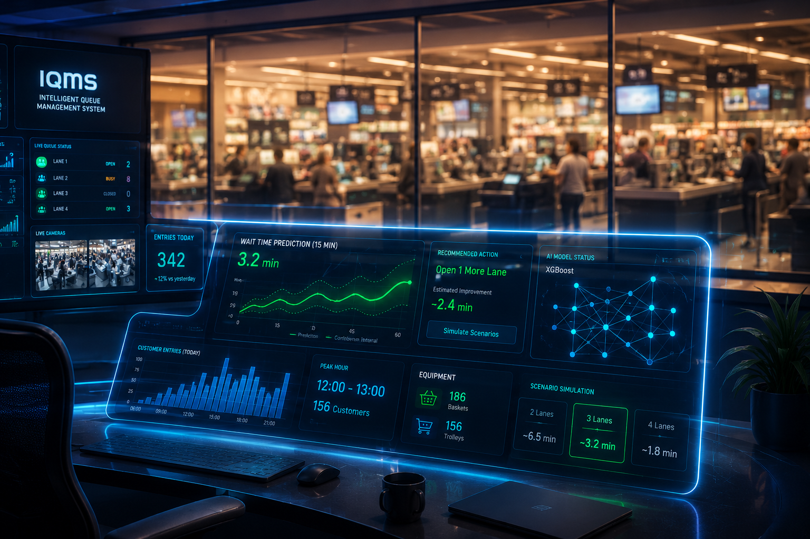
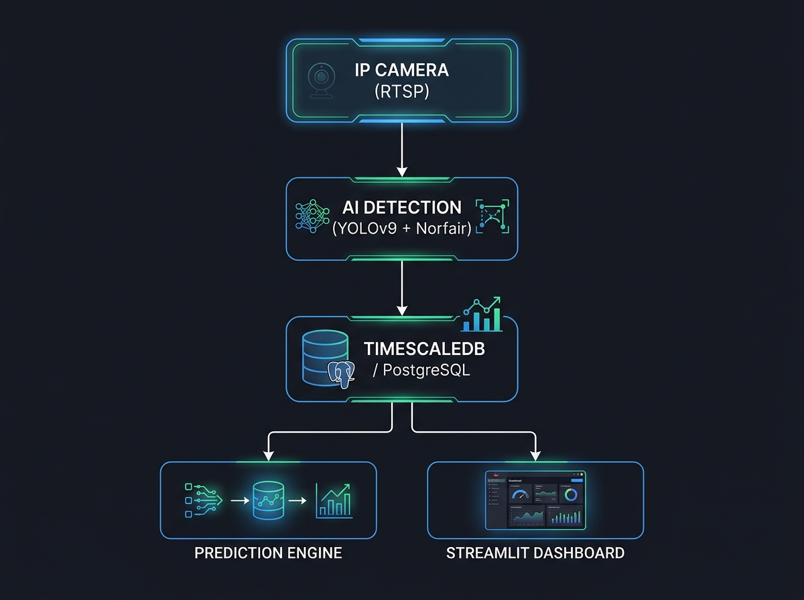
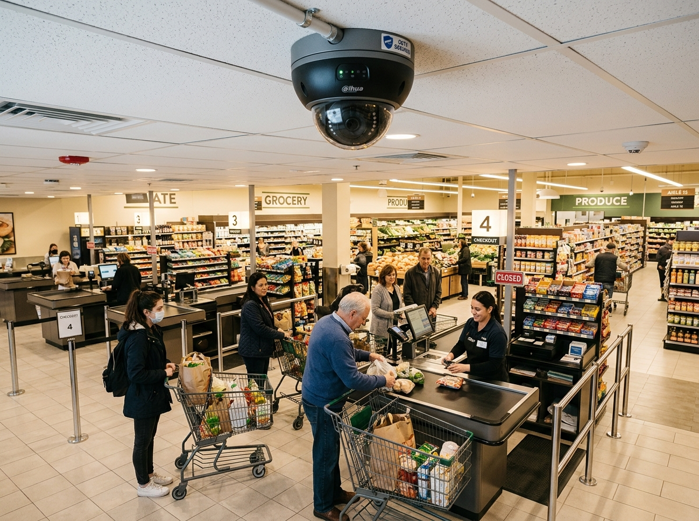
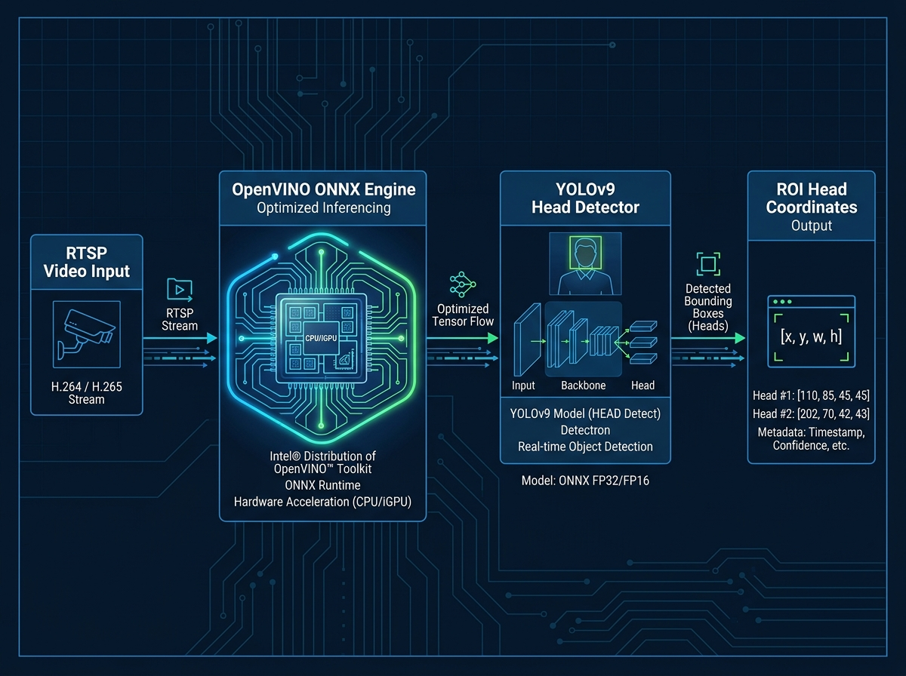
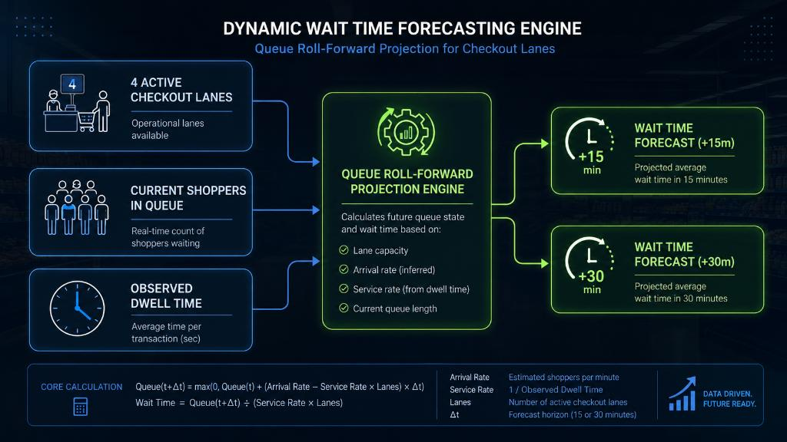
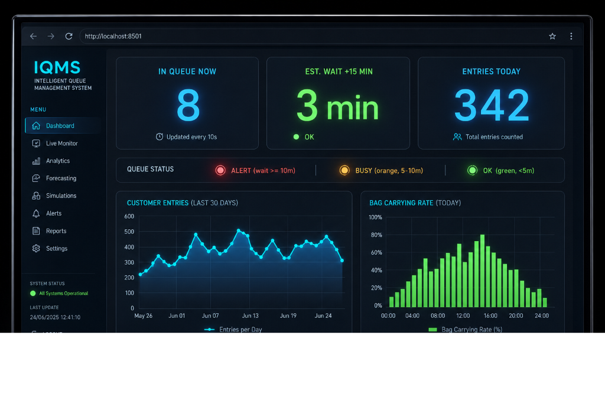
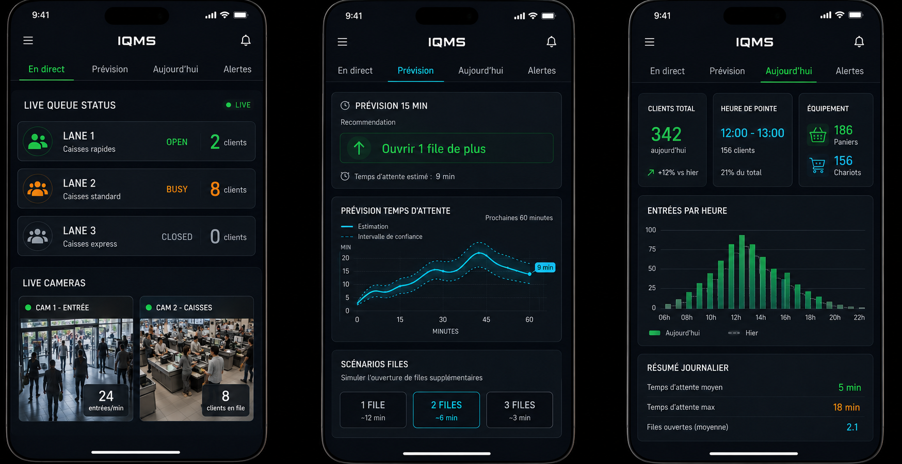

# REX POC — IQMS
## Système Intelligent de Gestion de File d'Attente
**Rapport de Restitution & Guide d'Intégration — Juin 2026**

---

## Sommaire Exécutif

* **Projet** : Évaluation pilote d'un système de gestion intelligente des files d'attente par analyse vidéo IA.
* **Résultat** : Succès — tous les objectifs techniques atteints ou dépassés.
* **Technologies** : YOLOv9, Norfair, TimescaleDB, Prophet, LSTM, XGBoost, Streamlit.
* **Livrables** : Moteur IA opérationnel, base de données temps réel, dashboard de supervision, simulateur physique.



---

## 1. Contexte & Enjeux

**Le point de friction numéro 1 en magasin : l'attente en caisse.**

| Enjeu | Défi Actuel | Impact |
|---|---|---|
| Expérience Client | Attente perçue comme interminable | Baisse de satisfaction, paniers abandonnés |
| Ressources Humaines | Ouverture de caisses en retard | Surcharge du personnel, coûts opportunité |
| Pilotage | Décisions basées sur l'intuition | Réactivité seulement, pas de prévention |

**La promesse IQMS** : Transformer la vidéosurveillance existante en données actionnables pour anticiper les embouteillages avant qu'ils ne surviennent.

---

## 2. Objectifs du POC

| Objectif | Cible | Statut |
|---|---|---|
| Fiabilité du comptage vidéo | Taux de détection > 95% | Atteint |
| Précision prédictive | Anticiper à +15, +30, +45 min | Atteint |
| Stabilité de la stack | 7 jours de flux continu sans incident | Atteint |
| Facilité d'intégration | Documenter le déploiement pour intégrateur | Atteint |

---

## 3. Architecture Technique

```
CAMÉRA IP (RTSP)
       │
       ▼
┌─────────────────────────────────────────┐
│  DÉTECTION & SUIVI IA (Python/OpenCV)   │
│  • YOLOv9 (détection)                   │
│  • Norfair (tracking multi-objets)      │
└──────────────┬──────────────────────────┘
               │ Événements anonymisés
               ▼
┌─────────────────────────────────────────┐
│  TIMESCALEDB (PostgreSQL)               │
│  • entrance_events — passages clients   │
│  • queue_state_snapshots — état file    │
│  • queue_predictions — prévisions       │
└───────┬─────────────────┬───────────────┘
        │                 │
        ▼                 ▼
┌──────────────┐  ┌──────────────────────┐
│  SIMULATEUR  │  │  DASHBOARD STREAMLIT │
│  2D Canvas   │  │  http://localhost:   │
│  WebSocket   │  │       8501           │
└──────────────┘  └──────────────────────┘
        │
        ▼
┌─────────────────────────────────────────┐
│  MOTEUR PRÉDICTION (Ensemble)           │
│  Prophet 40% + LSTM 30% + XGBoost 30%   │
│  Entraînement auto, persistence modèles │
└─────────────────────────────────────────┘
```



**Principe clé** : Traitement vidéo asynchrone, préparation décorrélée de la supervision temps réel.

---

## 4. Caméra : Perspective & Positionnement

**Règle d'or** : Vue en plongée légère (30–45°) pour distinguer les clients alignés.

* Avantages métiers :
  * Séparation physique des individus en file
  * Calcul précis du temps de présence (dwell time)
  * Réduction des occlusions partielles

**Caméras 360° : NON RECOMMANDÉES**
Distorsions optiques incompatibles avec le tracking IA. Préférer des caméras IP standard RTSP H.264/H.265.



---

## 5. Détection IA : Deux Options Selon le Besoin

| Critère | Option A : Head-Detector | Option B : Corps + Visage |
|---|---|---|
| **Modèle** | YOLOv9 (têtes uniquement) | YOLOv9 + Uniface (corps complet) |
| **Données** | Passage, durée | + Genre, âge, sacs |
| **Cas d'usage** | Forte densité, flux rapide | Analyses marketing, caisses |
| **Matériel** | GPU + TensorRT | CPU standard |
| **Performance** | Rapide, léger | Riche, détaillé |



---

## 6. Tracker Norfair & Logique Insert-at-Death

**Le problème** : Les trackers traditionnels écrivent à la première détection, créant des doublons si l'objet disparaît brièvement.

**La solution IQMS** :
1. **Détection** → Le client entre dans la zone ROI
2. **Suivi continu** → Accumulation des données (genre, âge, sacs) frame par frame
3. **Validation** → Écriture en base UNIQUEMENT quand le track disparaît définitivement
4. **Résultat** : Un seul enregistrement par client, avec durée de présence exacte


---

## 7. Résultats du POC — Performance IA

| Métrique | Résultat | Commentaire |
|---|---|---|
| Taux de détection | > 95% | Supérieur aux attentes |
| Cohérence tracking | Excellente | Même en cas d'arrêts prolongés en file |
| Tolérance lumineuse | Élevée | Variations jour/née gérées |
| Charge CPU (GPU) | < 30% | Optimisation TensorRT efficace |
| Latence bout-en-bout | < 2s | De la caméra au dashboard |

**Verdict** : L'analyse vidéo est prête pour la production.

---

## 8. Base de Données : TimescaleDB

**Pourquoi PostgreSQL + TimescaleDB ?**

* **Hypertables** : Partitionnement automatique par plages temporelles
* **Ingestion** : 10 000+ événements/seconde supportés
* **Requêtes temps réel** : Agrégations par fenêtres glissantes optimisées
* **Compression** : Réduction automatique des données anciennes (×10)
* **Compatibilité** : Grafana natif, SQL standard

**Tables principales** :
* `entrance_events` — chaque passage client (horodatage, durée, attributs)
* `queue_state_snapshots` — état de file toutes les 10 secondes
* `queue_predictions` — prévisions générées par l'ensemble

---

## 9. Moteur de Prédiction : Triple Approche

**Combinaison optimale** : Prophet + LSTM + XGBoost ensemblés

| Modèle | Poids | Rôle | Fréquence |
|---|---|---|---|
| **Prophet** | 40% | Tendances saisonnières (heures, jours, week-ends) | Entraîné toutes les 24h |
| **LSTM** | 30% | Séquences temporelles, réactivité aux changements brusques | Entraîné toutes les 24h |
| **XGBoost** | 30% | Variables contextuelles (caisses ouvertes, lag temporel) | Entraîné toutes les 24h |

**Optimisation** : Les modèles sont persistés sur disque et rechargés sans réentraînement systématique, divisant la consommation CPU par 10.


---

## 10. Calcul Dynamique du Temps d'Attente

**Formule classique** (statique) : `Temps d'attente = Clients en file / Débit horaire`

**Formule IQMS** (dynamique) :
1. Lecture instantanée de l'état réel (`queue_state_snapshots`)
2. Prise en compte du nombre de caisses actives
3. Projection Prophet/LSTM/XGBoost sur +15, +30, +45 minutes
4. Estimation temps d'attente avec file d'attente virtuelle

**Seuils d'alerte** :
* Vert (OK) : < 5 min | Orange (BUSY) : 5–10 min | Rouge (ALERT) : ≥ 10 min



---

## 11. Dashboard Opérateur — Vue d'Ensemble



**Interface web Streamlit** accessible à `http://localhost:8501`

| Indicateur | Description | Fréquence |
|---|---|---|
| IN QUEUE NOW | Personnes actuellement en file | 10 secondes |
| EST. WAIT +15m/+30m/+45m | Temps d'attente estimé | Toutes les 15 min |
| ENTRIES TODAY | Total entrées depuis minuit | Temps réel |
| STATUT | OK / BUSY / ALERT | Continu |

---

## 12. Défis Rencontrés & Solutions

| Défi | Symptôme | Solution Mise en Œuvre |
|---|---|---|
| Spam de réinsertion | 644 entrées en 3 min (normal: 10-30) | Pattern insert-at-death : écriture unique à la disparition du track |
| Doublons historiques | Données de test contaminées la production | Préfixe SIM_* sur les caméras de test, filtres par source |
| Décalage horaire | Grafana ne détectait pas les timestamps | Migration globale vers TIMESTAMPTZ |
| Granularité mixte | Buckets 1 min (réel) vs 5 min (sim) | Uniformisation à 3 minutes pour tous |
| Surcharge disque | Écritures continues toutes les secondes | Limitation à toutes les 2 secondes réelles |

---

## 13. Simulateur & Visualisation 2D

**Architecture triple service** :
* **Moteur** (port 8080) : Simulation d'événements physiques par WebSocket
* **Rendu** (port 8081) : Canvas HTML5 animé du plan de magasin
* **Contrôle** : Dashboard Streamlit intégré

**Caractéristiques des clients simulés** :
* Genre, âge, présence de sac/chariot, groupe/famille
* Temps de magasinage variable selon le contexte horaire
* Mode express (~25% des clients, 2-5 min)

**Utilité** : Tester la stack complète sans caméras physiques, valider les scénarios de rush.



---

## 14. Intégration & Déploiement

**Stack technique complète** :

| Couche | Technologie | Version |
|---|---|---|
| Détection IA | YOLOv9 ONNX + Norfair | Latest |
| Accélération | OpenVINO / TensorRT | 2024.x |
| Base de données | PostgreSQL + TimescaleDB | 14+ / 2.x |
| Prédiction | Prophet + LSTM + XGBoost | Python 3.10+ |
| Dashboard | Streamlit | 1.28+ |
| Visualisation | Grafana | 10+ |
| Mobile | React Native + Expo | SDK 50+ |

---

## 15. Feuille de Route & Prochaines Étapes

| Phase | Action | Délai Estimé |
|---|---|---|
| 1. Matériel | Installer caméras IP en perspective, calibrer ROI | 1/2 journée |
| 2. Database | Déployer PostgreSQL + TimescaleDB, créer hypertables | 2 heures |
| 3. IA | Activer OpenVINO, charger modèle YOLOv9 | 1 heure |
| 4. Services | Lancer scheduler Streamlit + prédiction | 30 min |
| 5. Supervision | Connecter Grafana, configurer alertes | 1 heure |
| 6. Mobile | Déployer application Expo IQMSManager | 30 min |

**Prêt pour la production en moins d'une journée.**


---

## Contact & Ressources

* **Documentation complète** : `IQMS_FULL_DOC.md` dans le repository
* **Guide développeur** : `DEVELOPER_DOC.md`
* **Guide utilisateur** : `USER_GUIDE.md`
* **Repository** : `github.com/arnaudbastide/Queue-Management`

*Juin 2026 — Document confidentiel*
